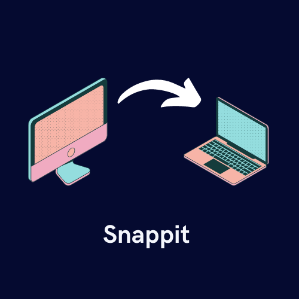
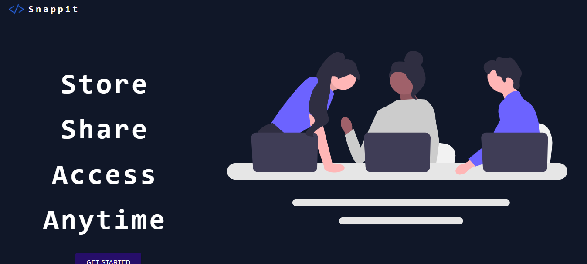

# Snippet Library

## Store, Share and Access your code snippet anywhere.



Please give this repo a ⭐ it really helps us!

### Setup

1. [Fork](https://github.com/Ravina-Deogadkar/snippet-library/fork) this repo by clicking the fork button in the top right to get started.
2. Clone the project, you can use the following command:

   ```bash
   git clone https://github.com/<your-github-username>/snippet-library
   ```
3. Navigate to the project directory

   ```bash
   cd snippet-library
   ```

### Deploying Backend

To deploy this project navigate to the backend folder and run

```bash
  cd backend
```

```bash
  npm install
```

```bash
  node index.js
```

or

```bash
  nodemon
```

### Deploying Frontend

To deploy this project navigate to the frontend folder and run

```bash
  npm install
```

```bash
  npm start
```

Navigate to `http://localhost:3000/`



## Feedback

If you have any feedback, please reach out to us at ravina.deogadkar@gmail.com
