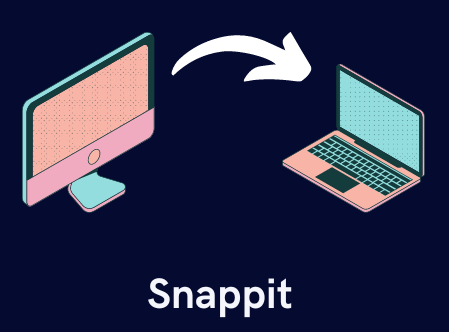

# Snippet Library

## Store, Share and Access your code snippet anywhere.



Please give this repo a ⭐ it really helps us!

### Deploying Backend

To deploy this project navigate to the backend folder and run

```bash
  cd backend
```

```bash
  npm install
```

```bash
  node index.js
```

or

```bash
  nodemon
```

### Deploying Frontend

To deploy this project navigate to the frontend folder and run

```bash
  npm install
```

```bash
  npm start
```

Navigate to `http://localhost:3000/`

### Setting up mongoDB

- Install and setup MongoDB by following official documentation
- Start MongoDBCompass and Connect to mongodb://localhost:27017

## Feedback

If you have any feedback, please reach out to us at ravina.deogadkar@gmail.com
